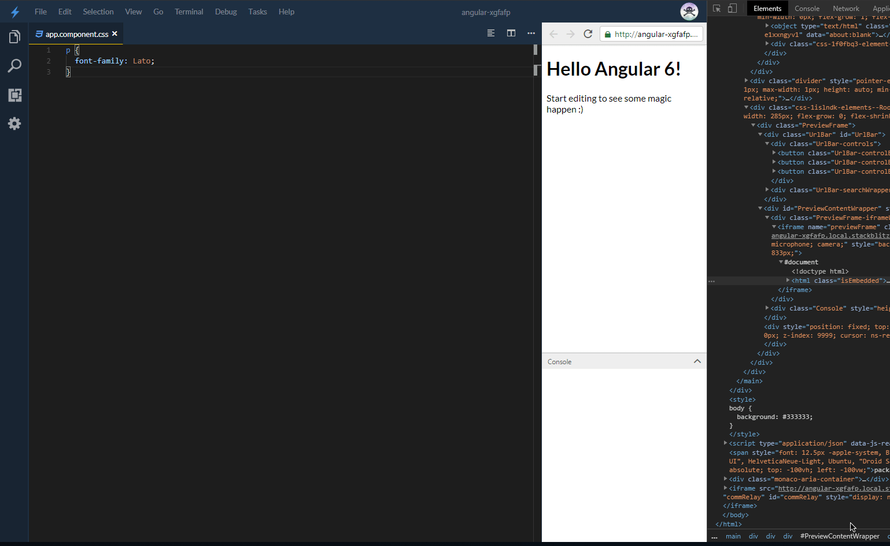
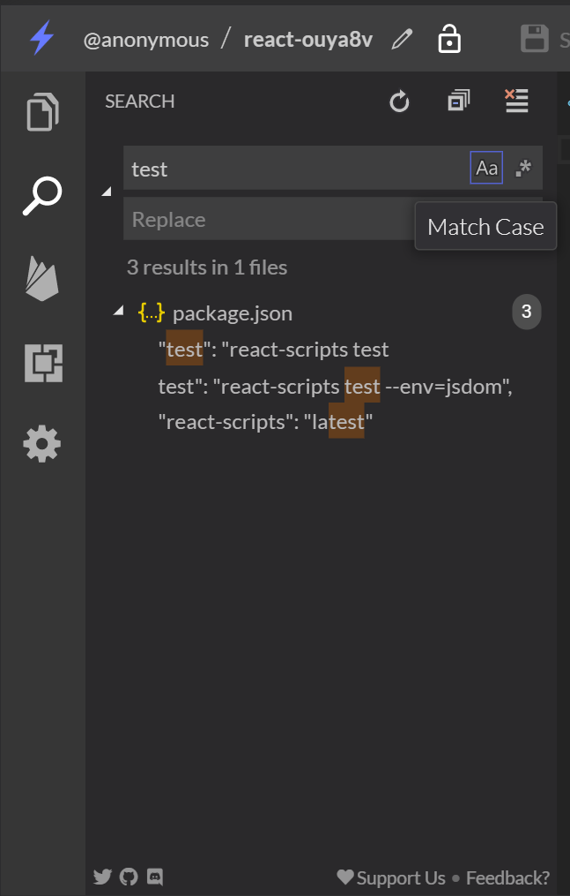
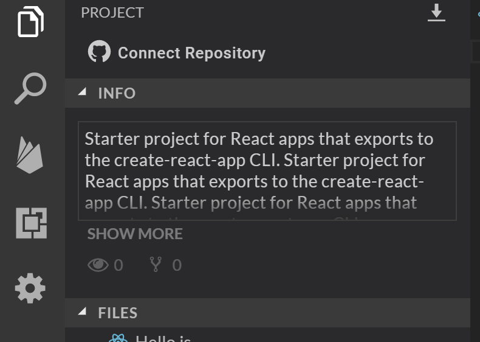
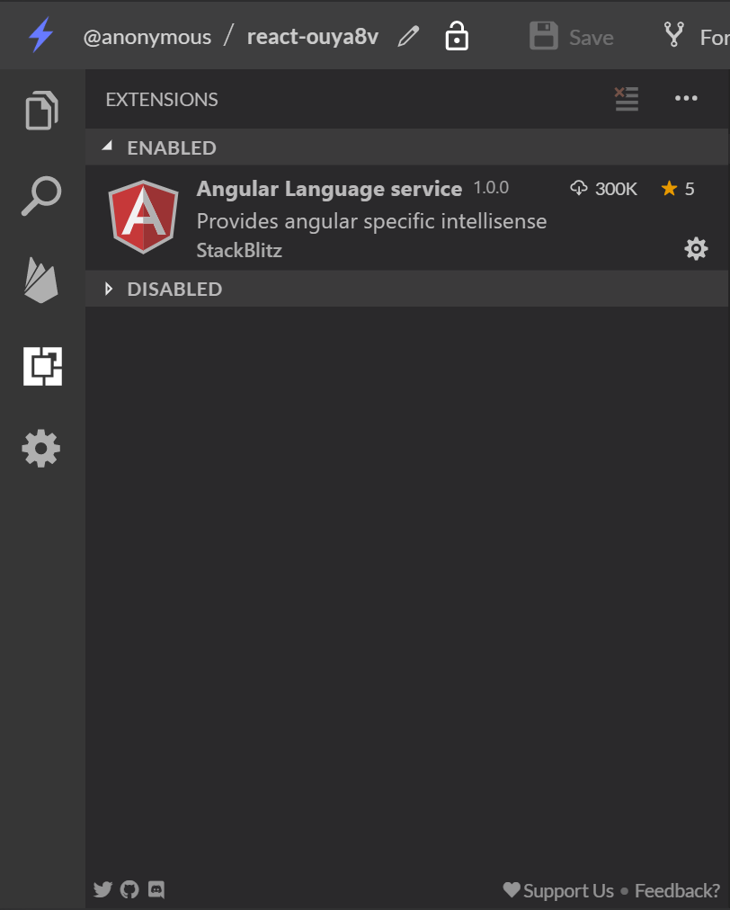
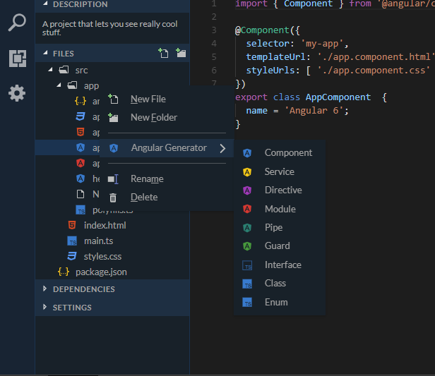
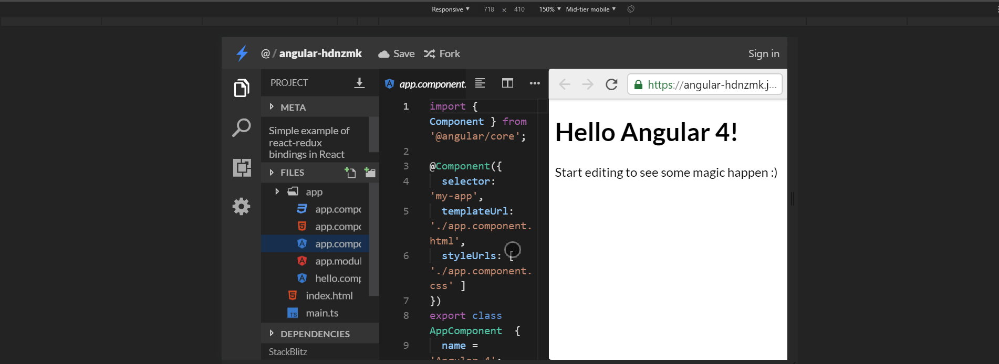

StackBlitz is the online code editor for web projects.

## Redesigning the editor

- Allowed the editor panes to be resizable
- Integrated editor-wide theming
- Custom menu bar, with alt-key & keyboard support

## Project search

Implemented a project search indexer, along with a corresponding UI. Matches are highlighted and can be collapsed.

## Responsive sidebar

Created a responsive, resizable sidebar, that can be used on mobile with the swipe-to-open gesture.

Dragging and dropping files will move them, once right clicked you'll have the option to rename them.

